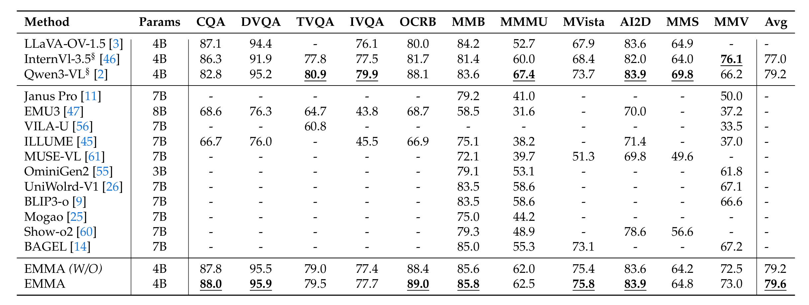
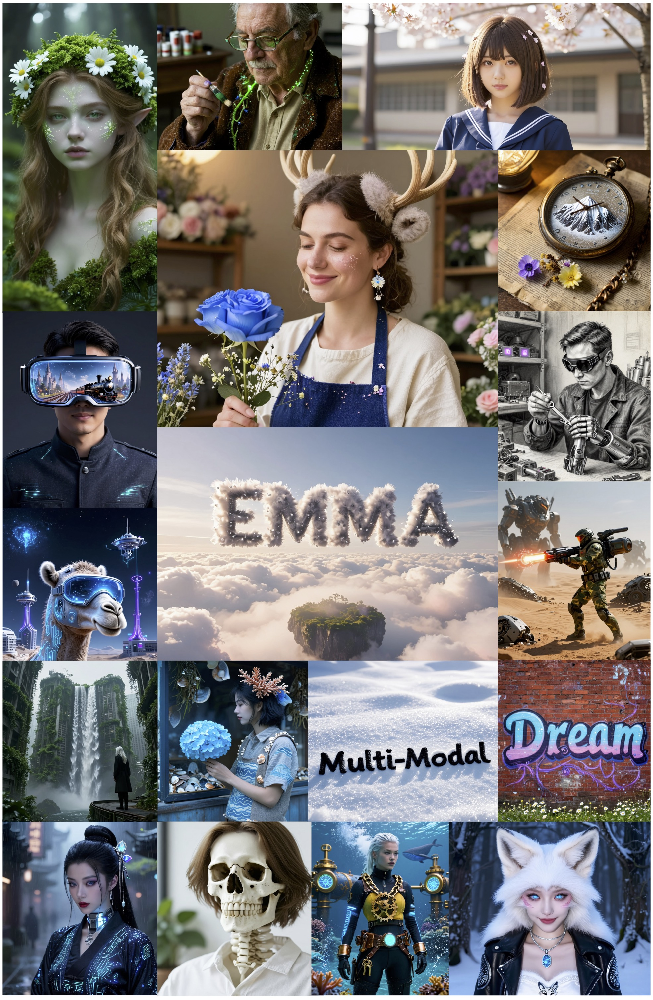
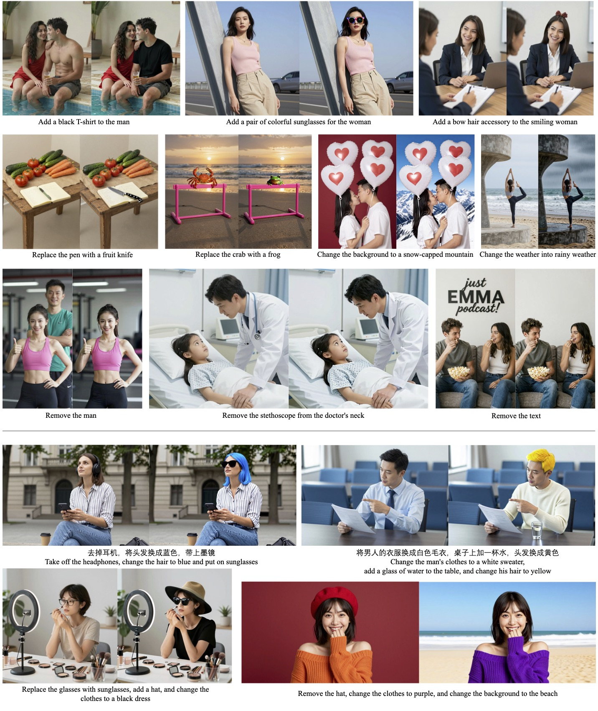

# EMMA: Efficient Multimodal Understanding, Generation, and Editing with a Unified Architecture
<a href="https://arxiv.org/abs/2512.04810" target="_blank"></a>


## 📰 News
* **[2025.12.04]**  🔥 We have released **EMMA: Efficient Multimodal Understanding, Generation, and Editing with a Unified Architecture**. Check out the **[** [Paper](https://arxiv.org/abs/2512.04810) **]**. 


## 🏆 Contributions

We propose EMMA, an efficient and unified architecture for multimodal understanding, generation and editing. Specifically, EMMA primarily consists of 1) An efficient autoencoder with a 32x compression ratio, which significantly reduces the number of tokens required for generation.This also ensures the training balance between understanding and generation tasks by applying the same compression ratio to images. 2) Channel-wise concatenation instead of token-wise concatenation among visual understanding and generation tokens, which further reduces the visual tokens in unified architectures. 3) A shared-and-decoupled network that enables mutual improvements across tasks while meeting the task-specific modeling requirements 4) A mixture-of-experts mechanism adopted for visual understanding encoder, which substantially improves perceptual capabilities with a few parameters increase. Extensive experiments have shown that EMMA-4B can significantly outperform state-of-the-art unified multimodal approaches (e.g., BAGEL-7B) in both efficiency and performance, while also achieving competitive results compared to recent multimodal understanding and generation experts (e.g., Qwen3-VL and Qwen-Image). We believe that EMMA lays a solid foundation for the future development of unified multimodal architectures.


## ✨ Comparison Result
* Comparison between different unified multimodal approaches across multimodal understanding, text-to-image generation, and image editing benchmarks.

* Comparisons with state-of-the-arts on multimodal understanding benchmarks.


## ✨ Image Generation



## ✨ Image Editing



## 📕 BibTeX 

```bib
@article{he2025emma,
  title={EMMA: Efficient Multimodal Understanding, Generation, and Editing with a Unified Architecture},
  author={He, Xin and Wei, Longhui and Ouyang, Jianbo and Xie, Lingxi and Tian, Qi},
  journal={arXiv preprint arXiv:2512.04810},
  year={2025}
}
```


We are looking for interns to join our team. If you are interested, please feel free to concat us at weilh2568@gmail.com or 15172448316@163.com
